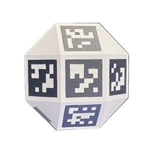

# BMTVG

    
  

This is the accompanying code repository for the paper "Bridging the Markerless Tracking Validation Gap: Intraoperative X-ray Workflow Integration", by Connor Daly[1], Salvatore Russo[2], Jinendra Ekanayake[3], Daniel Elson[1] and Ferdinando Rodriguez y Baena[1]. 
[1] Imperial College London
[2] Imperial College Healthcare Trust NHS
[3] Stanford University

## Contact :email:
For any questions regarding this repository or paper, please contact cd1723{at}ic[dot]ac[dot]uk

## About

This paper presents the first attempt at integrating sub-surface imaging for generating markerless tracking datasets.

For the fiducial marker and calibration phantom described in the paper, CAD designs can be found in calibration_phantom_cad_models and intraop_cad_models, respectively. All were printed using a Bambu X1e, with a 4mm nozzle, using Nanovia Tech PLA XRS (https://nanovia.tech/en/ref/nanovia-pla-xrs/) (1.75 mm)

The accompanying clinical mkv data collected can be in found in Data, with .mkv files on hugging face (https://huggingface.co/datasets/zcbecda/BMTVG). mkv files and aligned ply meshes can be viewed with the raw_visualizer.py script in /Scripts. The vertebra meshes are generated using marching cubes on the patient CT scans. Vertebra can be partitioned using vertex colour.

P.S.
Please bear with us while we work on making the code less spaghetti like

Bottom left shows intraoperative fiducial, bottom right is the calibration phantom, both under fluoroscopic imaging. Design files in the repo.

  
  

